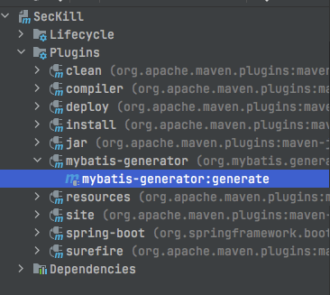
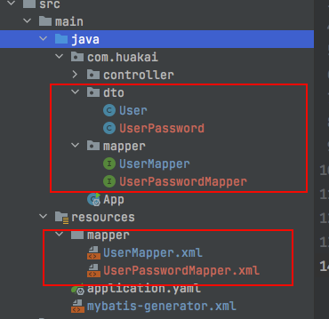

# Refenence

[SpringBoot使用Mybatis-Generator](https://www.jianshu.com/p/a8bfc14a3534)

# 如何使用

在SpringBoot项目中引入相关依赖

```xml

<build>
    <plugins>
        <plugin>
            <groupId>org.mybatis.generator</groupId>
            <artifactId>mybatis-generator-maven-plugin</artifactId>
            <version>1.3.2</version>
            <executions>
                <execution>
                    <id>mybatis-generator</id>
                    <phase>deploy</phase>
                    <goals>
                        <goal>generate</goal>
                    </goals>
                </execution>
            </executions>
            <configuration>
                <!-- Mybatis-Generator 工具配置文件的位置 -->
                <configurationFile>src/main/resources/mybatis-generator.xml</configurationFile>
                <verbose>true</verbose>
                <overwrite>true</overwrite>
            </configuration>
            <dependencies>
                <dependency>
                    <groupId>mysql</groupId>
                    <artifactId>mysql-connector-java</artifactId>
                    <version>5.1.46</version>
                </dependency>
                <dependency>
                    <groupId>org.mybatis.generator</groupId>
                    <artifactId>mybatis-generator-core</artifactId>
                    <version>1.3.2</version>
                </dependency>
            </dependencies>
        </plugin>
        <plugin>
            <groupId>org.springframework.boot</groupId>
            <artifactId>spring-boot-maven-plugin</artifactId>
            <configuration>
                <classifier>exec</classifier>
            </configuration>
        </plugin>
    </plugins>
</build>
```

添加成功后maven会多出一个`mybatis-generator`插件，**后续使用该插件就可生成代码**



`resource/mybatis-generator.xml`

```xml
<?xml version="1.0" encoding="UTF-8"?>
<!DOCTYPE generatorConfiguration
        PUBLIC "-//mybatis.org//DTD MyBatis Generator Configuration 1.0//EN"
        "http://mybatis.org/dtd/mybatis-generator-config_1_0.dtd">

<generatorConfiguration>

    <context id="MySql" defaultModelType="flat">

        <plugin type="org.mybatis.generator.plugins.SerializablePlugin"/>

        <jdbcConnection
                driverClass="com.mysql.jdbc.Driver"
                connectionURL="jdbc:mysql://localhost:3306/seckill"
                userId="root"
                password="Zyt98218."/>

        <!-- DO即对应的数据库 -->
        <javaModelGenerator targetPackage="com.huakai.mapper.dataobject"
                            targetProject="src/main/java"></javaModelGenerator>

        <sqlMapGenerator targetPackage="mapper" targetProject="src/main/resources"></sqlMapGenerator>

        <javaClientGenerator targetPackage="com.huakai.mapper" targetProject="src/main/java"
                             type="XMLMAPPER"></javaClientGenerator>


        <table tableName="user_info" domainObjectName="UserDO" enableCountByExample="false"
               enableUpdateByExample="false"
               enableDeleteByExample="false" enableSelectByExample="false" selectByExampleQueryId="false">
        </table>


        <table tableName="user_password" domainObjectName="UserPasswordDO" enableCountByExample="false"
               enableUpdateByExample="false"
               enableDeleteByExample="false" enableSelectByExample="false" selectByExampleQueryId="false">
        </table>

    </context>

</generatorConfiguration>
```

生成资源如图所示



# 数据库脚本

[seckill.sql](./seckill.sql)

